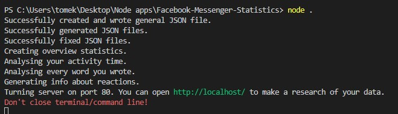
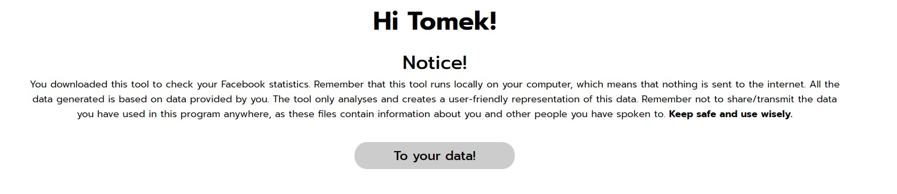
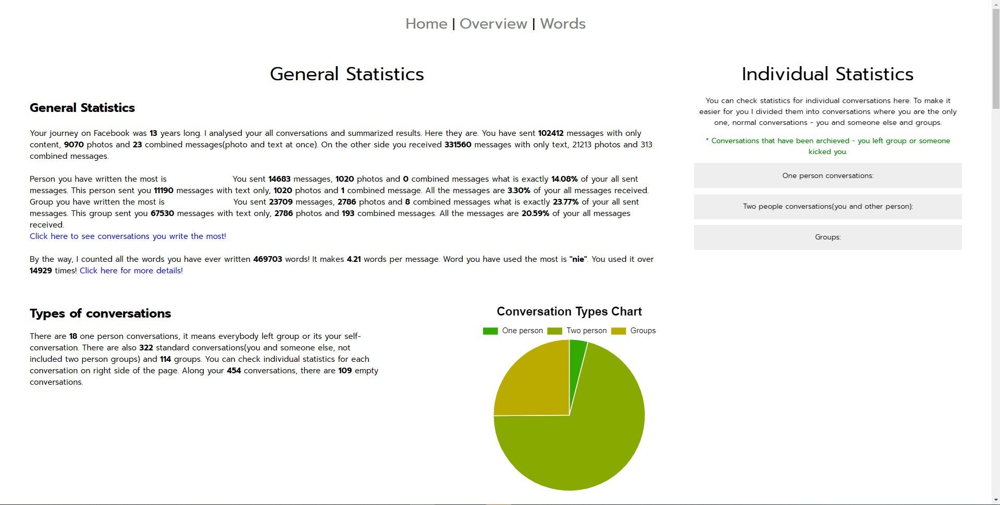
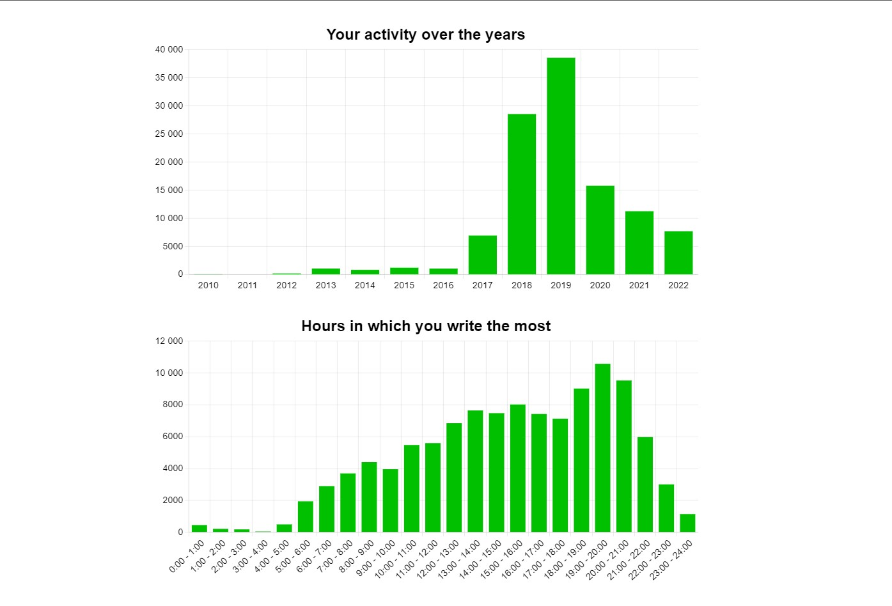
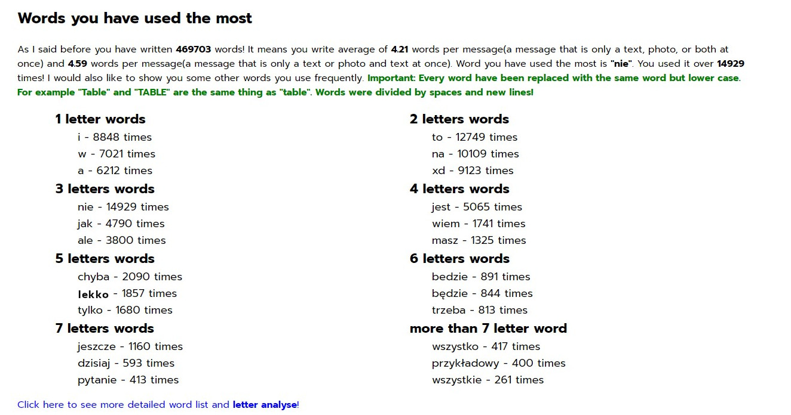
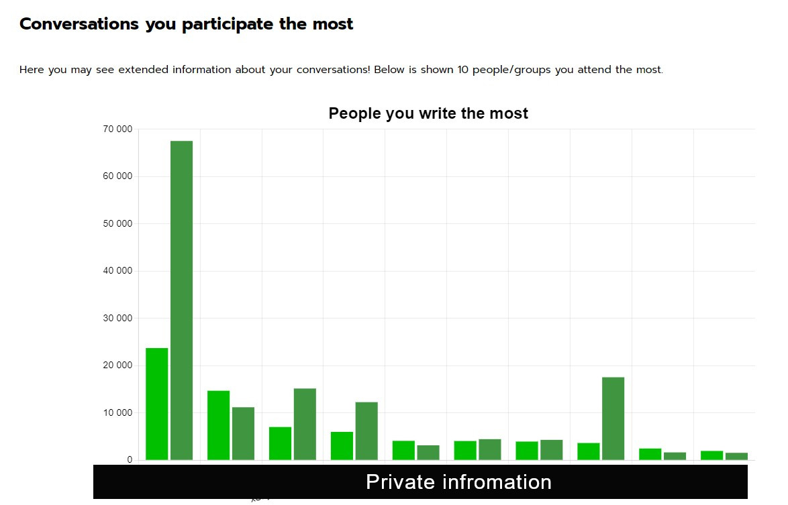
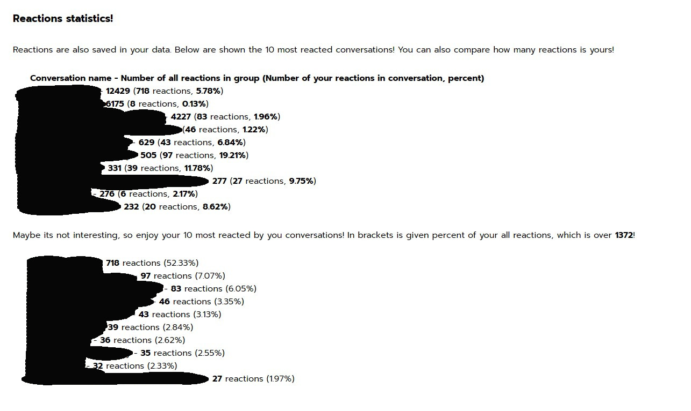
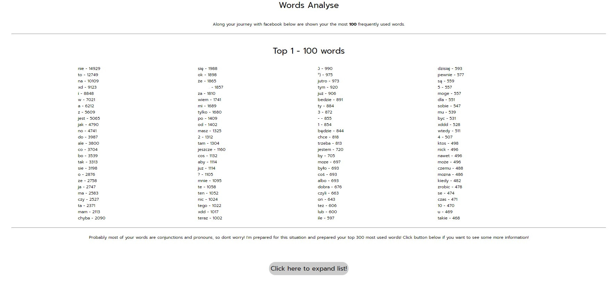
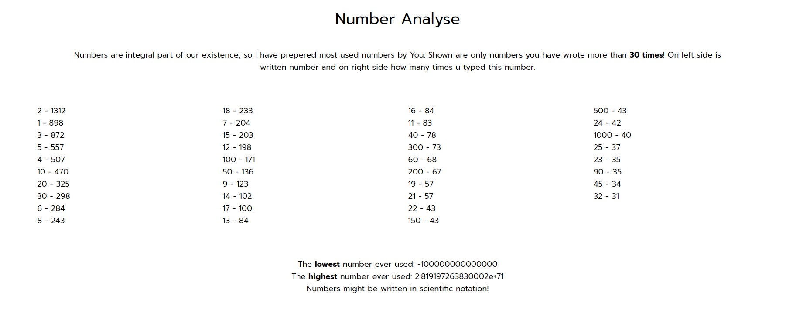
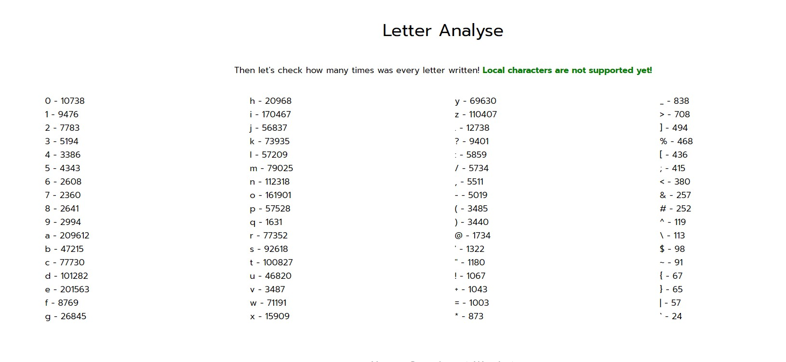

# Facebook-Messenger-Statistics-NodeJS

## How to run tool
First of all you have to install [Node.js](https://nodejs.org/en/) and npm(npm is installed alongside node js).
Then you can run the tool with command below.

```
node .
```



Turn on your website and go to localhost page. Thats all! Enjoy researching your data.

## Home page
Read the notice it is very important!


## General statistics
As soon as you go to statistics page you will see so much data. On the left side are visible general data and on the right side you can see individual statistics. I seperated them so you may look for them more easily. They dont show too much atm.


## Activity time
Those two statistics are probably the most interesting as they show when you are the most active.


## Most used words 
Here you can see most used 1, 2, 3, 4, 5, 6, 7 and 7 or more words. You can click here to see more detailed list of words(about this a little bit later)


## The most participated conversations


## Reactions
The most "reactive" and most reacted by you conversations.


Most used reactions along all conversations.


## Most used words
Detailed list of 100 words with possibility to expand!


## Most used numbers
Its pretty interesting statistic about numbers in your online life.


## Most used letters
You can see here what your most clicked letters look like along with numbers and special characters


Enjoy!